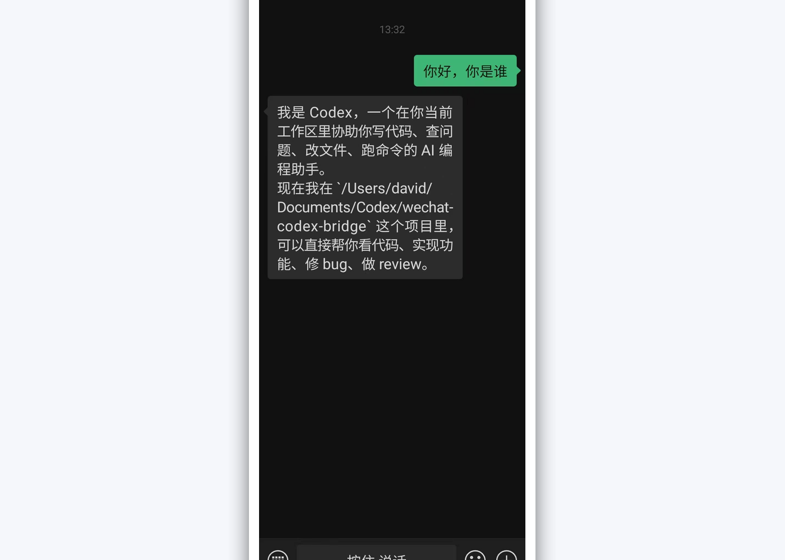
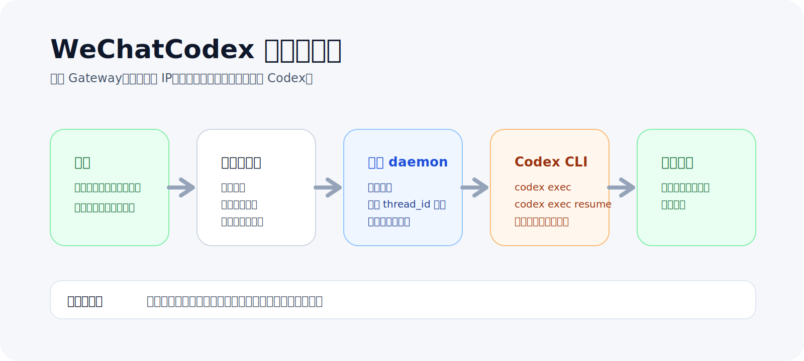
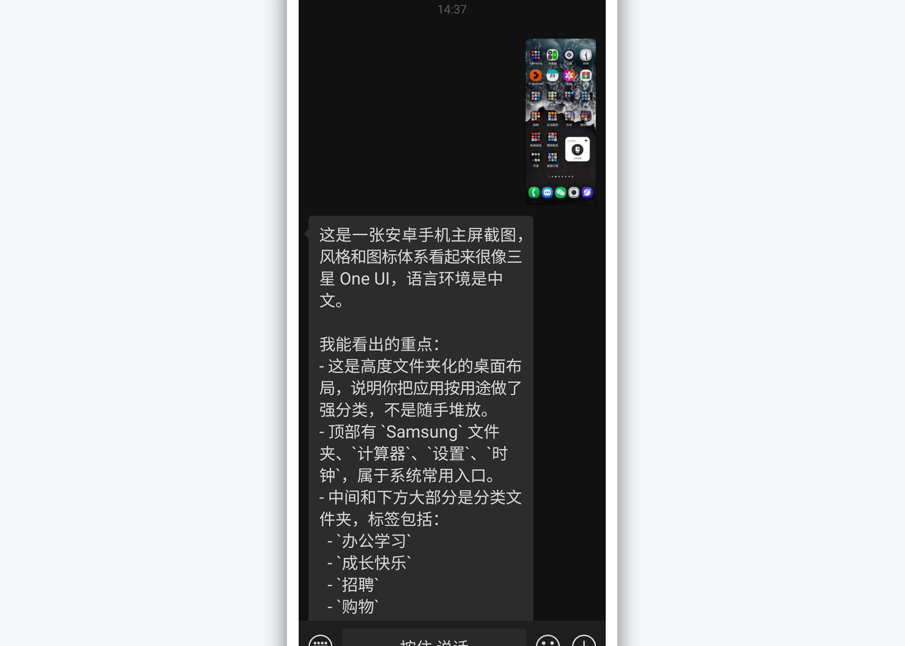

# 我把 Codex 接进了微信，现在可以直接在聊天框里给它派活了

这个项目受了《在微信里使用 Claude Code，刚刚在 GitHub 上开源了这个 Skill。》的启发。但我这次要做的，不是复刻一遍 Claude，而是把 Codex 做成一个真正顺手、能长期跑的微信入口。

项目已经开源：

https://github.com/DrDavidDa/WeChatCodex

*图 1：第一次把 Codex 真正接进微信以后，聊天框就成了一个随手可用的入口。*

## 先看亮点

- 直接在微信里给本机 Codex 派活，不用远程桌面，不用先回到终端。
- 支持多轮上下文，消息会按 `thread_id` 接回同一条会话。
- 支持图片分析，不只是“提示收到”，而是真的下载、解密、交给 Codex 处理。
- 支持 `/status`、`/clear`、`/cwd`、`/model`、`/mode` 等命令。
- macOS 上可以用 `launchd` 常驻，重启以后还能继续跑。

## 这件事为什么值得做

我一直对“把入口做薄”这件事很有兴趣。

不是为了炫一个“微信里也能跑 AI”，而是为了把一个本来只能坐在电脑前完成的动作，改成你在路上也能随手触发的动作。

你突然想到一个需求，发条微信过去；本机上的 Codex 开始执行；等你回到电脑前，结果可能已经在那儿了。

这和远程控制电脑不是一回事。

我想做的，是把 Codex 本身变成一个低摩擦入口，而微信只是那个几乎没有学习成本的壳。

## 我怎么把它做出来

我这次选的方案很直接：

`微信 -> 微信协议层 -> 本地 daemon -> Codex CLI -> 微信`

没有接 Gateway，没有配公网 IP，也没有折腾域名。

原因很简单。对个人开发者来说，链路越短，越容易稳定，越容易长期维护。

只要扫码绑定、长轮询、消息解析、媒体下载这些底层链路跑通，后面的执行器就只是一个可以替换的模块。这次我把它换成了 Codex CLI。

所以这个项目最后收敛成了几块很实用的东西：

- 微信协议层
- 本地守护进程
- Codex 桥接层
- 会话持久化
- 图片处理
- 命令系统

我没有故意把它做得很花。我更关心的是三件事：能不能持续跑，出问题能不能定位，真实消息来了会不会露馅。

*图 2：整条链路其实很短，重点不是“接了多少层”，而是每一层都能稳定工作。*

## 真正难的，不是接通，而是把坑踩完

这类桥接项目最容易出现一种假象：演示能跑，一上真实消息就开始失真。

我这次最典型的两个坑，刚好都说明了这一点。

第一个坑，是第一条消息能回，后面就没反应。

最后查出来不是微信协议坏了，而是 `codex exec resume` 被我放在轮询线程里同步等待了。只要 Codex 忙一点，后面的消息就全部堵住。

这个问题后来被我拆掉了：

- Codex 执行改成后台异步
- 增加子进程超时保护
- daemon 启动时清理遗留的 `processing` 状态

第二个坑，是图片其实收到了，但下载和解密链路错了。

我最初按旧结构读图片字段，真实线上消息却是另一套 payload。结果用户看到的是“图片已收到，但下载或解密失败”，本质上不是没收到，而是协议适配层判断错了。

我把真实图片链路重新对齐以后，这条能力才算真正闭环：

- 按真实结构读取 `image_item.media`
- 优先使用正确的图片密钥
- 修正微信图片 CDN 下载地址

*图 3：图片链路修完以后，微信里发图就不再只是“收到提醒”，而是真的能交给 Codex 分析。*

我不太喜欢那种“看起来能用，但真实场景一来就开始胡说”的工具。所以这部分我宁愿多花时间，也要把它收干净。

## 现在 WeChatCodex 已经到了什么程度

它现在已经不是一个演示用 demo 了，而是一套能在我机器上稳定跑的本地服务。

目前已经支持：

- 微信文字消息接入本机 Codex
- 基于 `thread_id` 的多轮上下文
- 图片消息交给 Codex 分析
- 常用 slash 命令控制运行状态
- `launchd` 常驻运行
- 本地保存账号、配置、日志和会话

对我来说，一个项目值不值得继续做，不看它“概念上新不新”，而看它有没有把一条真实工作流补完整。

WeChatCodex 做到的，正是这一点。

## 最后

如果你也想把本机上的 Codex 接到微信里，可以直接看这个项目：

https://github.com/DrDavidDa/WeChatCodex

我一直很看重一类项目：先把真实链路打通，再把工程慢慢打磨到别人也能复用。

WeChatCodex 现在还只是一个开始，但它已经把最关键的一步跑出来了。
